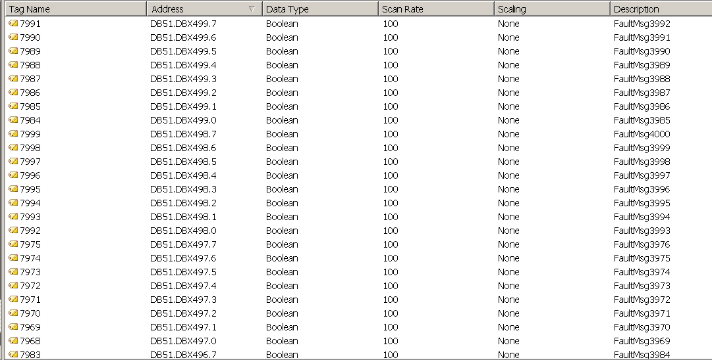
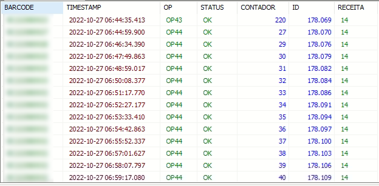
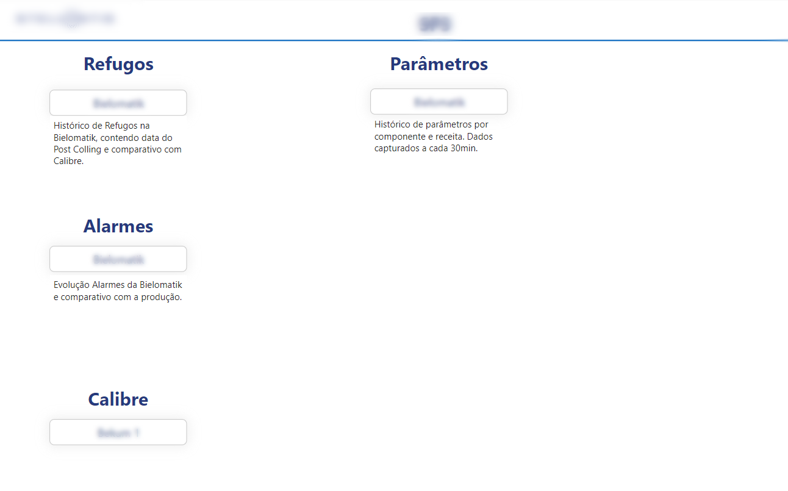
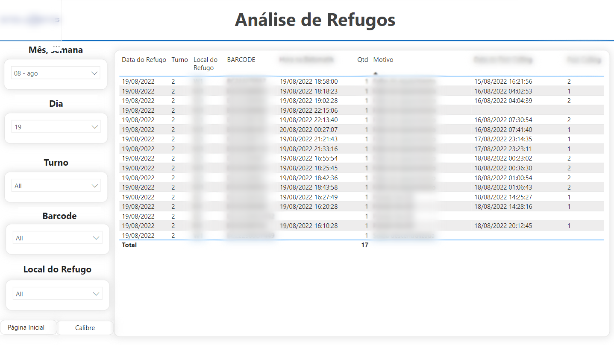
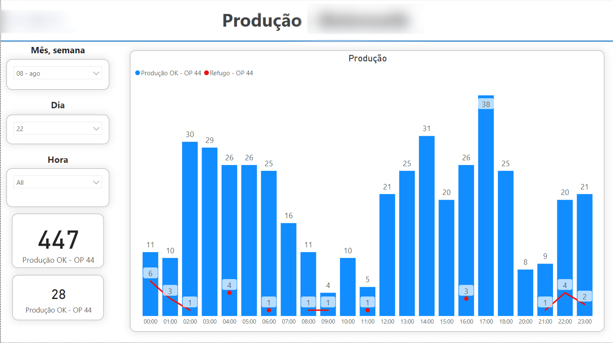
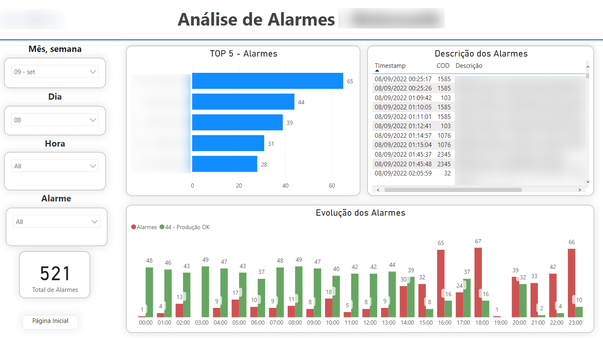

# PRODUCTION, FAILURES AND SCRAPS REPORT

In the manufacturing process, it’s usual to have manual counting of produced pieces. The problem is even greater when it comes to scrap, since a bad piece can go unnoticed.  For these problems, I created a system that automatically obtains data from the machines and stores it in a database.  Finally, a Power BI report was created to obtain access to this data.

  
## CREATION OF BACKEND AND DATABASE
Initially I had to create a database to store data and set up a connection between the machine's PLCs and the database created. To achieve this, I used **OPC UA communication**. The first step consists of open the **PLC software** and analyze which signal will be useful to store on database.

   PLC'S SIGNAL ANALYZE 

 
After the communication has been created, the following step was create the database and setup OPC UA to save data in the databse. The database used was **Microsoft SQL Server.**

   CREATION OF DATABASE

  

## CREATION OF THE REPORT
After setup connection and database properly, I had to start creating the reports. The first one was a 'main page' which brings to another pages.

   MAIN PAGE

  

The page 'SCRAP ANALYZE' tell details about all scrap like datetime of event, shift, component that cause the scrap, cause and other quality details. It is even possible to filter by date/hour/barcode/shift.

   SCRAPS DETAILS PAGE

  

Scrap VS Production page shows how the line has performed in terms of production and scrap, in a certain period of time. It can be shown by month/week/day/hour and give details about production and scrap.

   SCRAP VS PRODUCTION PAGE

  

Failures page show details about the events/failures in machine. It shows the timestamp of each event and some description about the event. It is possible to filter by period of time or a specific alarm. It is very usefull to analyse how a single alarm is going on and what relevante the alarm has, in terms of productive capacity.

   FAILURES PAGE

  

## IMPROVEMENTS
The reports shows very useful, specially to managers. However, the best solution for the production team would be a mobile platform, instead of computer-based (Power BI). It could be done by using Microsoft Power Apps but the company still in process of implementation of this software.
Another point that would be great to managers is a report that shows more details about scraps, like the complete reason that makes each scrap.