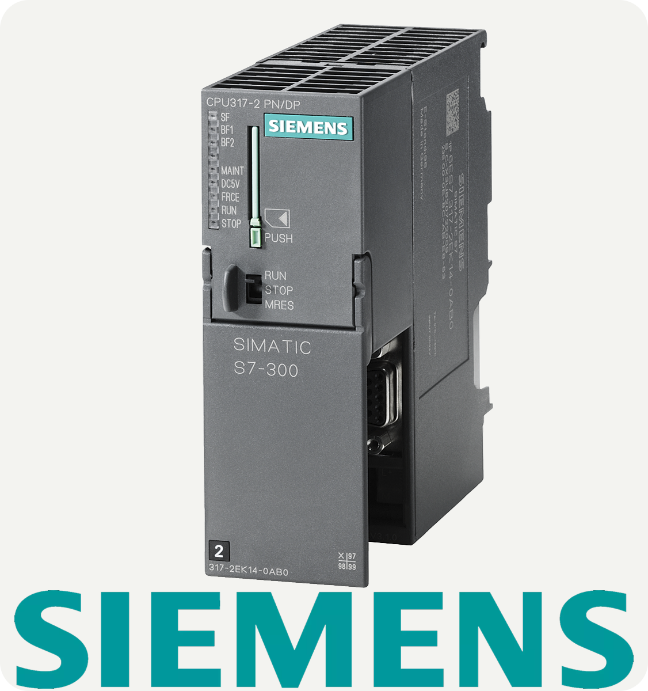

<h1 align="center">IIoT </h1>
<h3 align="center">Here is some solutions I've found to get a better performance in Manufacturing Process and Automation. You'll find in this repository a lot of mixed tools. </h3>

 
<h3 align="left">Folders</h3>

1. <a href="https://github.com/VinicioAM/IIoT/tree/main/Production_and_Scrap-Report" target="_blank" rel="noreferrer"> **Production, Failures and Scrap Report**</a>
    * A system created to automatically obtains data from the machines and store it in a database. The final Result is a Power BI report.
    * **30% SIEMENS S7 PLC**   - Necessary to analyze how the machine works, which signal must be monitored.
    * **30% OPC UA**   - OPC has been used to set up connection between PLC/SQL Server Database and monitor the relevants signals from PLC. 
    * **20% SQL Server** - Necessary to create a Databse to store informations, like the production, scraps and failures history.
    * **20% Power BI**  - The final report has been created in Power BI and shared to managers.
    * **Source code not avaliable** because it has a lot of internal company information. Anyway, feel free to contact me and I'll be glad to help.
 